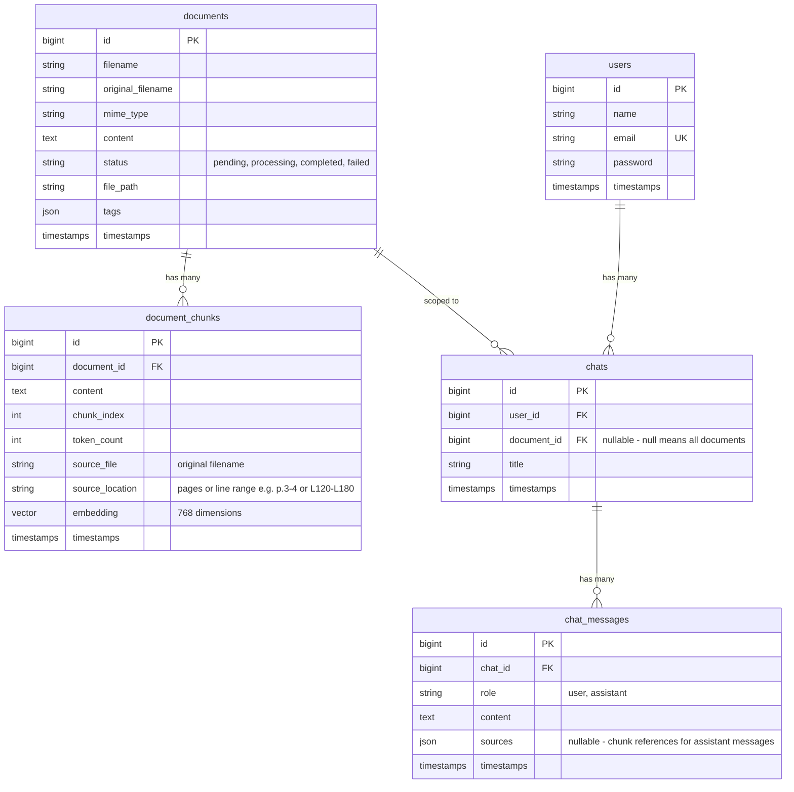

# PRD: NandoRAG

> Internal document RAG tool for importing documents, generating embeddings, and chatting with your knowledge base using Ollama.

| Field | Value |
|---|---|
| **Type** | Internal Tool |
| **Status** | Draft |
| **Created** | 2026-04-04 |
| **Stack** | Laravel 13, Filament 5, Pest 4, PostgreSQL + pgvector, laravel/ai |
| **AI Provider** | Ollama (local) |

---

## 1. Problem & Context

### Problem Statement

Knowledge is scattered across PDF, Markdown, and text files with no unified way to search or query them semantically. Traditional keyword search misses context and relationships between documents.

### Solution

NandoRAG is an internal, self-hosted RAG (Retrieval-Augmented Generation) tool that:
- Imports documents (PDF, MD, TXT) and converts them to text
- Chunks documents with overlap and generates vector embeddings via Ollama
- Stores embeddings in PostgreSQL with pgvector for similarity search
- Provides an AI chat interface to query documents using natural language
- Runs entirely locally with no external API dependencies

### Target User

Single user (the developer/owner). Login-protected admin panel with a seed user.

---

## 2. Technical Stack

| Component | Technology | Details |
|---|---|---|
| Framework | Laravel 13 | Latest version |
| Admin Panel | Filament 5 | Single admin panel |
| Testing | Pest 4 | With parallel support |
| Database | PostgreSQL + pgvector | Vector similarity search |
| AI SDK | laravel/ai | Embeddings + chat completions |
| AI Provider | Ollama (local) | No cloud API keys needed |
| Embedding Model | `nomic-embed-text` | 768 dimensions |
| Chat Model | `llama3.2:3b` | Small, fast, low resource usage |
| PHP | 8.2+ | Required by Filament 5 |

---

## 3. Architecture Overview

```mermaid
graph TB
    subgraph "Frontend"
        LP[Landing Page - Guest]
        AP[Admin Panel - Filament 5]
    end

    subgraph "Admin Panel Pages"
        DR[Documents Resource]
        CP[Chats Page]
        HP[Help & Status Page]
    end

    subgraph "Backend"
        CS[Chunking Service]
        ES[Embedding Service - laravel/ai]
        RS[RAG Retrieval Service]
        SS[Streaming Chat Service]
    end

    subgraph "Infrastructure"
        PG[(PostgreSQL + pgvector)]
        OL[Ollama Server]
    end

    LP --> AP
    AP --> DR
    AP --> CP
    AP --> HP

    DR --> CS --> ES --> PG
    CP --> RS --> PG
    CP --> SS --> OL
    RS --> OL
    ES --> OL
```



---

## 4. Data Model



---

## 5. Features

### 5.1 Landing Page (Guest)

- **Route**: `/` (root)
- **Type**: Filament guest panel page
- **Content**: App name "NandoRAG" centered vertically and horizontally
- **Design**: Will be designed later; minimal placeholder for now
- **Auth**: No authentication required

### 5.2 Admin Panel

- **Route**: `/admin`
- **Auth**: Filament login required
- **Seed User**: `nando@example.com` / `password`
- **Guard**: Default `web` guard

### 5.3 Document Resource (Filament CRUD)

Full Filament resource for managing documents.

#### Upload & Import
- Single file upload per document (PDF, MD, TXT)
- File validation: max size TBD, mime types restricted to pdf/md/txt
- On create: extract text content from uploaded file
  - **PDF**: Use `smalot/pdfparser` or similar PHP library
  - **MD/TXT**: Read as plain text
- Store original file on disk, extracted text in `content` column

#### Chunking
- **Strategy**: Fixed-size chunks with overlap
- **Chunk size**: 512 tokens (configurable)
- **Overlap**: 50 tokens (configurable)
- Chunks stored in `document_chunks` table with sequential `chunk_index`
- Each chunk records `source_file` (original filename) and `source_location`:
  - **PDF**: Page range (e.g., "p.3-4") based on which pages the chunk spans
  - **MD/TXT**: Line range (e.g., "L120-L180") based on the original file line numbers

#### Embedding Generation
- **Processing**: Synchronous (on upload/save)
- **Model**: `nomic-embed-text` via Ollama
- **Dimensions**: 768
- **Method**: `laravel/ai` Embeddings API
  ```php
  Embeddings::for($chunkContent)->generate(Lab::Ollama, 'nomic-embed-text');
  ```
- Each chunk gets its own embedding vector stored in pgvector column
- **Status tracking**: `pending` -> `processing` -> `completed` / `failed`

#### Tagging
- Auto-tag with filename on import
- Additional tags via Filament `TagsInput` field
- Tags stored as JSON array on document

#### Table View
- Columns: filename, mime_type, tags, status, chunk count, created_at
- Filters: status, mime_type
- Search: filename, tags
- Bulk delete action

#### Form View
- File upload field (create only)
- Filename (auto-filled, editable)
- Tags input
- Content (read-only textarea, shows extracted text)
- Status badge (read-only)

### 5.4 Chats Page (Filament Custom Page)

Custom Filament page at `/admin/chats` for AI conversations.

#### Chat Tabs
- Each chat appears as a tab
- Tabs show the chat title (editable inline)
- "New Chat" button creates a new tab
- Close/delete tabs

#### Chat Scope
- Option to scope chat to a **specific document** or **all documents**
- Selectable via dropdown when creating a new chat
- Scope affects which chunks are retrieved for RAG context

#### Chat Interface
- Message input at the bottom
- Messages displayed in a scrollable container
- User messages aligned right, assistant messages aligned left
- **Streaming**: Tokens appear in real-time as the model generates them
- Markdown rendering for assistant responses

#### RAG Pipeline (per user message)

1. Generate embedding for the user's query using `nomic-embed-text`
2. Vector similarity search against `document_chunks`:
   - If scoped to a document: filter by `document_id`
   - If all documents: search across all chunks
   - **Similarity threshold**: 0.5 minimum
   - **Top K**: 10 chunks returned
3. Build prompt with retrieved chunks as context
4. Send to Ollama `llama3.2:3b` with streaming enabled
5. **Show sources**: For each retrieved chunk, display the source filename (`source_file`) and location (`source_location` - page range for PDFs, line range for MD/TXT) alongside the chunk excerpt

#### Persistence
- All chats and messages stored in database
- Survive page reloads and sessions
- Chat list loads on page mount

### 5.5 Help & Status Page (Filament Custom Page)

Custom Filament page at `/admin/help` for Ollama configuration guidance and connection status.

#### Connection Status Panel
- **Ollama Server**: Connected/Disconnected indicator (ping `OLLAMA_BASE_URL`)
- **Embedding Model**: Available/Not Found indicator (check if `nomic-embed-text` is pulled)
- **Chat Model**: Available/Not Found indicator (check if `llama3.2:3b` is pulled)
- Auto-refresh status on page load
- Manual "Check Status" button

#### Setup Guide Content
Static help content covering:

1. **Installing Ollama**
   - Download and install instructions
   - Starting the Ollama server

2. **Pulling Required Models**
   ```bash
   ollama pull nomic-embed-text
   ollama pull llama3.2:3b
   ```

3. **Environment Configuration**
   ```env
   OLLAMA_BASE_URL=http://localhost:11434
   ```

4. **Laravel/AI Configuration**
   - Setting Ollama as default provider for embeddings and text
   - Config key reference from `config/ai.php`

5. **Troubleshooting**
   - Common connection issues
   - Model not found errors
   - Memory/resource requirements

---

## 6. Configuration

### Environment Variables (.env)

```env
# Database
DB_CONNECTION=pgsql
DB_HOST=127.0.0.1
DB_PORT=5432
DB_DATABASE=nandorag
DB_USERNAME=nandorag
DB_PASSWORD=secret

# Ollama
OLLAMA_BASE_URL=http://localhost:11434

# RAG Settings (optional, with defaults in config)
RAG_CHUNK_SIZE=512
RAG_CHUNK_OVERLAP=50
RAG_SIMILARITY_THRESHOLD=0.5
RAG_TOP_K=10
```

### config/ai.php Overrides

```php
'default_for_text' => 'ollama',
'default_for_embeddings' => 'ollama',

'providers' => [
    'ollama' => [
        'driver' => 'ollama',
        'url' => env('OLLAMA_BASE_URL', 'http://localhost:11434'),
        'models' => [
            'text' => ['default' => 'llama3.2:3b'],
            'embeddings' => [
                'default' => 'nomic-embed-text',
                'dimensions' => 768,
            ],
        ],
    ],
],
```

---

## 7. Non-Functional Requirements

| Requirement | Target |
|---|---|
| Deployment | Local / single server |
| Auth | Single user, Filament login |
| External dependencies | None (Ollama runs locally) |
| File storage | Local disk |
| Max document size | Reasonable for local processing |
| Response time | Depends on Ollama hardware |
| Browser support | Modern browsers (Chrome, Firefox, Safari) |

---

## 8. Testing Strategy

### Unit Tests (Pest 4)
- Chunking service: correct chunk sizes, overlap, edge cases
- Text extraction: PDF, MD, TXT parsing
- Tag management: auto-tagging, manual tags

### Feature Tests (Pest 4)
- Document CRUD: create, read, update, delete
- Document upload and text extraction
- Embedding generation flow
- Chat creation and message persistence
- RAG retrieval pipeline (with mocked Ollama responses)
- Help page status checks

### Filament Smoke Tests
- Document resource: list, create, edit pages render
- Chat page renders
- Help page renders
- Login/auth flow

---

## 9. File Structure (Expected)

```
app/
  Enums/
    DocumentStatus.php          # pending, processing, completed, failed
    ChatMessageRole.php         # user, assistant
  Filament/
    Admin/
      Resources/
        DocumentResource.php
        DocumentResource/
          Pages/
            ListDocuments.php
            CreateDocument.php
            EditDocument.php
      Pages/
        Chats.php
        Help.php
  Models/
    User.php
    Document.php
    DocumentChunk.php
    Chat.php
    ChatMessage.php
  Services/
    ChunkingService.php
    DocumentImportService.php
    RagRetrievalService.php
config/
  rag.php                       # RAG-specific config (chunk size, overlap, thresholds)
database/
  migrations/
    create_users_table.php
    create_documents_table.php
    create_document_chunks_table.php
    create_chats_table.php
    create_chat_messages_table.php
  seeders/
    DatabaseSeeder.php          # Seeds nando@example.com
```

---

## 10. Implementation Phases

### Phase 1: Project Setup
- Initialize Laravel 13 project
- Install Filament 5, laravel/ai, pgvector
- Configure PostgreSQL + pgvector extension
- Configure Ollama in config/ai.php
- Create guest landing page with "NandoRAG" centered
- Create admin panel with login
- Seed user migration (nando@example.com / password)

### Phase 2: Document Resource
- Create Document and DocumentChunk models + migrations
- Create DocumentStatus enum
- Build ChunkingService (fixed-size + overlap)
- Build DocumentImportService (PDF/MD/TXT text extraction)
- Build Filament Document resource (CRUD + upload + tagging)
- Generate embeddings synchronously on document create
- Filament smoke tests + feature tests

### Phase 3: Chat System
- Create Chat and ChatMessage models + migrations
- Create ChatMessageRole enum
- Build RagRetrievalService (similarity search + context building)
- Build Chats Filament custom page with tabs
- Implement streaming chat responses
- Show source chunks in responses
- Persist chat history
- Feature tests + smoke tests

### Phase 4: Help & Status Page
- Build Help Filament custom page
- Implement Ollama connection status checks
- Implement model availability checks
- Write setup guide content
- Smoke tests

---

## 11. Open Questions

| # | Question | Default |
|---|---|---|
| 1 | Max file upload size? | 10MB |
| 2 | PDF parsing library preference? | smalot/pdfparser |
| 3 | Should chunk size/overlap be configurable from admin UI? | No, config file only |
| 4 | Landing page design details? | Deferred to later |
